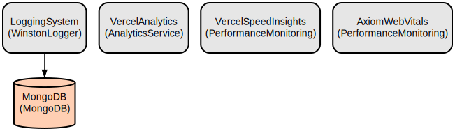

# DevoCode - A Collaborative Educational Resource Platform for LPU Students

DevoCode is a modern web platform that enables LPU (Lovely Professional University) students to share and access study resources in an organized and secure manner. Built with Next.js and MongoDB, it provides a centralized hub where students can collaborate, share study materials, and access educational resources across different subjects.

The platform features a robust authentication system, resource management capabilities, and an intuitive user interface. Users can upload various types of resources including notes, assignments, MCQs, and reference materials. The platform also includes features like CGPA calculation, user profiles, and administrative controls to ensure content quality and security. With real-time logging, secure file storage using AWS S3, and comprehensive user management, DevoCode creates an efficient and reliable educational resource sharing ecosystem.

## Repository Structure
```
.
├── app/                      # Next.js application pages and routing
│   ├── auth/                # Authentication related pages
│   ├── dashboard/           # User dashboard views
│   ├── resources/          # Resource management pages
│   └── settings/           # User settings and configuration
├── components/             # Reusable React components
│   ├── common/            # Shared UI components (navbar, sidebar, etc.)
│   ├── Dashboard/         # Dashboard-specific components
│   ├── landingpage/       # Landing page sections
│   └── resources/         # Resource management components
├── middleware/            # Authentication and authorization middleware
├── models/               # MongoDB schema definitions
├── pages/                # API routes and endpoints
│   └── api/             # REST API implementations
├── utils/               # Utility functions and configurations
└── assets/             # Static assets and icons
```

## Usage Instructions
### Prerequisites
- Node.js 16.x or higher
- MongoDB database
- AWS S3 bucket for file storage
- Gmail account for email notifications

### Installation
```bash
# Clone the repository
git clone <repository-url>
cd devocode

# Install dependencies
npm install

# Set up environment variables
cp .env.example .env.local

# Configure environment variables in .env.local:
NEXT_PUBLIC_MONGO_URL=<your-mongodb-url>
NEXT_PUBLIC_GMAIL=<your-gmail>
NEXT_PUBLIC_GMAIL_PASSWORD=<your-gmail-app-password>
NEXT_PUBLIC_AWS_ACCESS_KEY=<your-aws-access-key>
NEXT_PUBLIC_AWS_SECRET_KEY=<your-aws-secret-key>
NEXT_PUBLIC_S3_BUCKET_NAME=<your-s3-bucket-name>

# Start development server
npm run dev
```

### Quick Start
1. Register an account or log in to access the platform
```typescript
// Example login request
const response = await fetch('/api/auth/login', {
  method: 'POST',
  body: JSON.stringify({
    username: 'user@example.com',
    password: 'password123'
  })
});
```

2. Navigate to the Resources section to browse or upload materials
```typescript
// Example resource upload
const formData = new FormData();
formData.append('file', fileObject);
formData.append('title', 'Resource Title');
formData.append('type', 'notes');

await fetch('/api/resources/resources', {
  method: 'POST',
  body: formData
});
```

### More Detailed Examples
1. Creating a new subject:
```typescript
const response = await fetch('/api/resources/subjects', {
  method: 'POST',
  body: JSON.stringify({
    code: 'CSE101',
    title: 'Introduction to Computer Science',
    description: 'Fundamental concepts of programming'
  })
});
```

2. Updating user profile:
```typescript
const response = await fetch('/api/user', {
  method: 'PUT',
  body: JSON.stringify({
    name: 'John Doe',
    email: 'john@example.com',
    phone: '1234567890'
  })
});
```

### Troubleshooting
1. Authentication Issues
- Error: "Invalid token"
  - Clear browser local storage
  - Re-login to the application
  - Check if JWT_SECRET_KEY is properly set

2. File Upload Problems
- Error: "File size exceeds limit"
  - Ensure file size is under 4MB
  - Check AWS S3 bucket permissions
  - Verify AWS credentials in environment variables

3. Database Connection Issues
- Error: "MongoDB connection failed"
  - Verify MONGO_URL in environment variables
  - Check network connectivity
  - Ensure MongoDB instance is running

## Data Flow
DevoCode follows a client-server architecture where the Next.js frontend communicates with the API endpoints to manage resources and user data. All data is stored in MongoDB with files being stored in AWS S3.

```ascii
Client (Next.js) --> API Routes (/api/*) --> MongoDB/S3
     ↑                    |
     |                    v
User Authentication <-- JWT Token
```

Key component interactions:
1. Authentication flow uses JWT tokens for secure access
2. Resource uploads are processed through S3 for storage
3. User actions are logged using Winston logger
4. Real-time updates use client-side state management
5. API routes handle data validation and processing
6. MongoDB stores user data, subjects, and resource metadata
7. Email notifications use nodemailer with Gmail SMTP

## Infrastructure


### Storage
- MongoDB Database: Stores user data, subjects, resources metadata, and logs
- AWS S3 Bucket: Stores uploaded resource files

### Monitoring
- Vercel Analytics: Tracks application performance
- Speed Insights: Monitors page load times
- Axiom Web Vitals: Collects core web vitals metrics

### Logging
- Winston Logger: Handles application logging
- MongoDB Transport: Stores logs in production
- File Transport: Stores error and combined logs
- Console Transport: Development environment logging